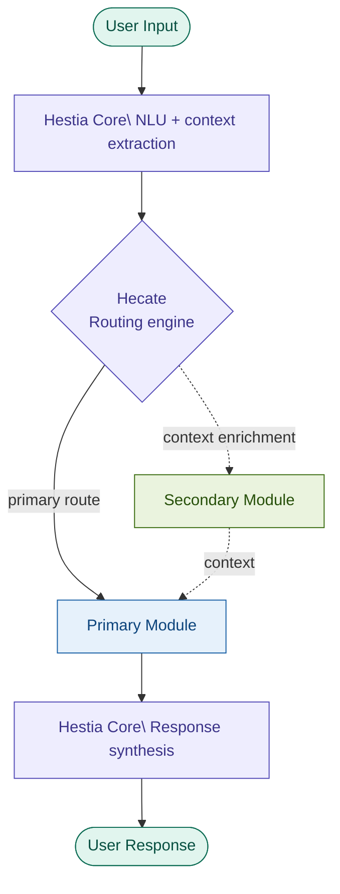
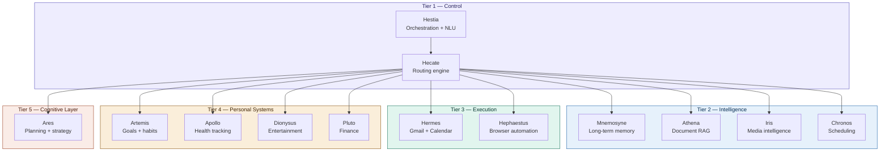
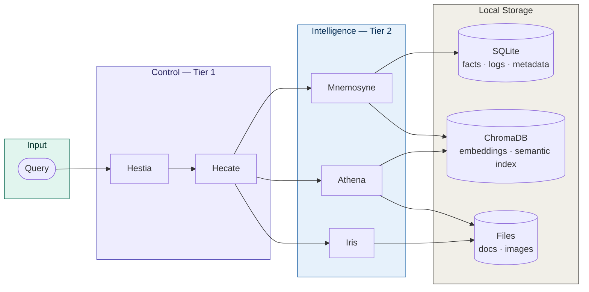

# Hestia

**Hestia** is a local-first, modular personal AI system that unifies your documents, memory, media, and personal context into a single intelligent assistant—running entirely on your own machine.

Think of it as a **private, extensible AI operating system for your life**.

---

## Overview

Most AI tools are fragmented—one for notes, one for documents, one for media.

**Hestia is a synthesis system.**

It integrates multiple data sources into a single assistant capable of **cross-domain reasoning**, while ensuring **full data ownership** and **local execution**.

---

## What Hestia Can Do

- Chat with your personal documents (RAG)
- Remember facts, preferences, and past interactions
- Search and understand images using AI-generated captions
- Combine memory, documents, and context in a single query
- Execute actions like scheduling, planning, and tracking
- Run fully locally (no data leaves your system unless enabled)

---

## Why Hestia

- **Local-first** — your data never leaves your machine
- **Unified intelligence** — memory + documents + media in one system
- **Cross-module reasoning** — answers combine multiple data sources
- **Modular architecture** — easily extensible and maintainable
- **Deterministic routing** — predictable, controllable behavior

---

## System Architecture

### Execution Flow

Every query follows the same deterministic path through the system. No module calls another directly — all routing is centralized through Hecate.



> **Design contract:** Modules never call each other. Hecate is the single source of routing truth. Context enrichment (dashed lines) is additive — the primary module always owns the response.

---

### Module Tiers

Hestia is organized into five tiers. Tier 1 orchestrates everything; lower tiers handle progressively more specialized domains.



---

### Data Flow by Module

Where each query type goes and what storage it touches:



> All storage lives under `/data`. No external calls are made unless explicitly configured.

---

## Key Features

### Core Capabilities
- Natural language query routing across modules
- Retrieval-Augmented Generation (RAG) over personal documents
- Long-term memory with semantic recall
- Image understanding via captioning + tagging
- Cross-module reasoning and synthesis

### Interfaces
- CLI
- Web UI (Flask)
- Voice mode (optional)
- Telegram bot (optional)

---

## Example Queries

### Memory
- "What do you know about me?"
- "What did I tell you yesterday?"

### Documents
- "Explain entropy from my notes"
- "Search for turbulence modeling papers"

### Images
- "Find photos where someone is reading"
- "Describe the latest image"

### Cross-Module
- "Compare what I've studied with my goals"
- "Summarize my recent work and highlight gaps"

---

## Installation

### Prerequisites

- Python 3.10+
- Ollama
- (Optional) Tesseract OCR

### Setup

```bash
git clone https://github.com/Akhil-025/hestia.git
cd hestia

python -m venv .venv

# Windows
.venv\Scripts\activate

# Linux/macOS
source .venv/bin/activate

pip install -r requirements.txt

# Install models
ollama pull mistral
ollama pull llava:7b
```

### Running Hestia

**CLI**
```bash
python main.py
```

**Web UI**
```bash
python web_ui.py
# Access: http://localhost:5000
```

**Voice Mode**
```bash
python main.py --voice
```

**Telegram Bot (optional)**
```bash
python -m core.telegram_bot
```

---

## Configuration

Main config: `config/laptop_config.yaml`

Controls:
- Model settings
- Module enable/disable
- Data paths
- External integrations

---

## Workflows

### Document Ingestion (Athena)
1. Add files to `data/athena/documents/`
2. Run ingestion via CLI or Web UI

### Memory (Mnemosyne)
- Automatically stores facts and interactions
- Enables semantic recall across conversations

### Image Processing (Iris)
1. Add images to configured directory
2. Run captioning + indexing

---

## Current Status

| Module | Status |
|---|---|
| Document RAG (Athena) | Stable |
| Memory system (Mnemosyne) | Stable |
| Image understanding (Iris) | Functional |
| Web UI | Basic but usable |
| Voice & Telegram | Optional, working |

---

## Limitations

- Image search is caption-based (no full visual similarity yet)
- Requires local model setup (resource intensive)
- Routing is improving (partially heuristic)
- No multi-device sync

---

## Roadmap

- [ ] Learning-based routing
- [ ] CLIP-based semantic image search
- [ ] Background ingestion pipelines
- [ ] Multi-device synchronization
- [ ] Deeper planning + reasoning capabilities

---

## Philosophy

- Local-first over cloud-dependent
- Modular over monolithic
- Deterministic routing over opaque behavior
- User data ownership as a core constraint

---

## Maintainer

**Akhil Pillai**  
Mechanical Engineering, SPCE Mumbai  
Focus: AI systems, simulation, and applied intelligence

GitHub: [https://github.com/Akhil-025](https://github.com/Akhil-025)

---

> Hestia is not just an assistant.
>
> It's an attempt to build a personal intelligence layer—  
> one that understands your data, evolves with you, and stays entirely under your control.